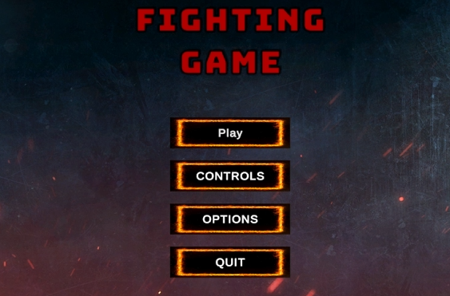
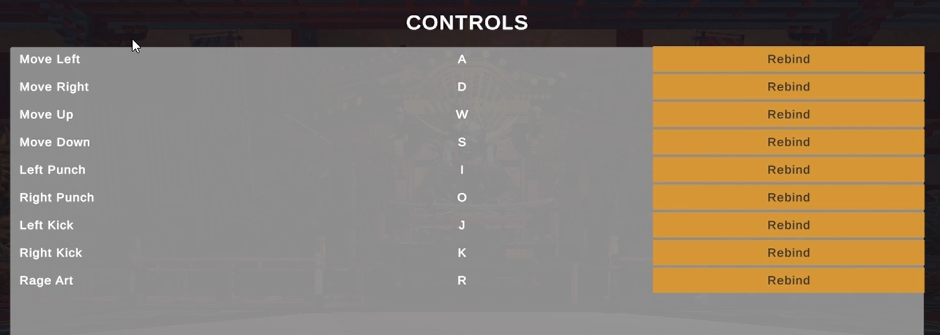
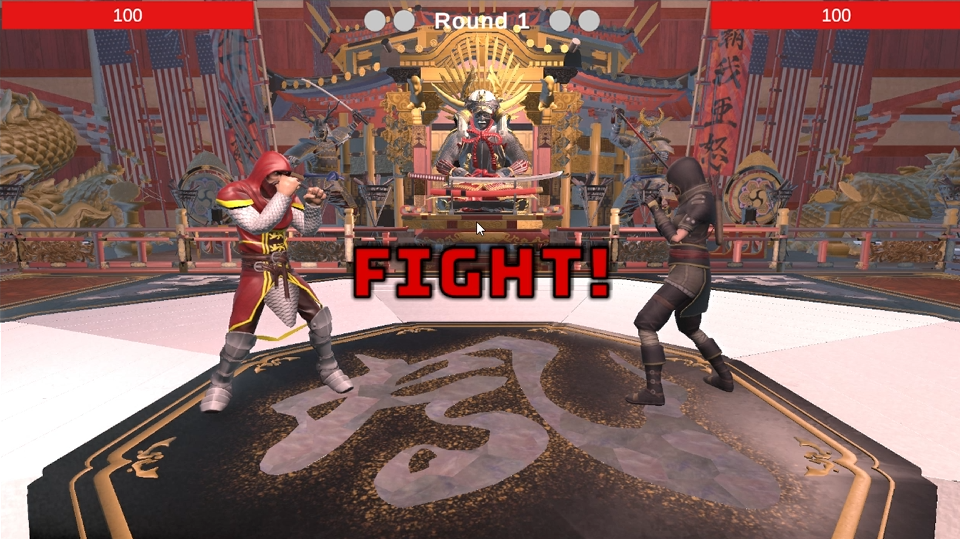
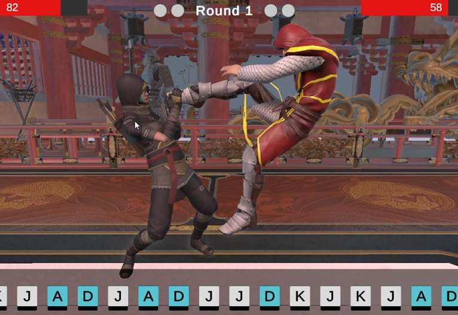
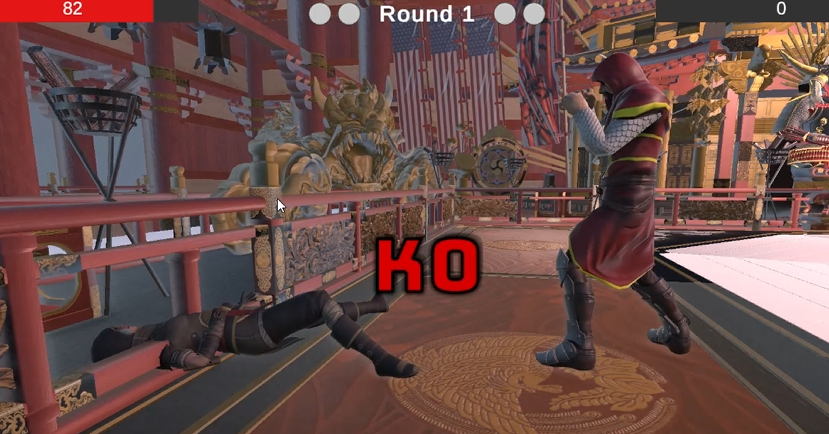
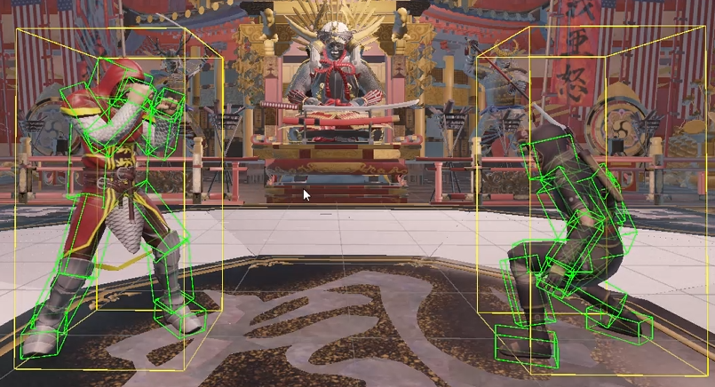
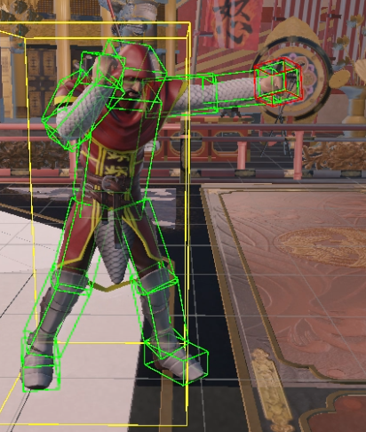
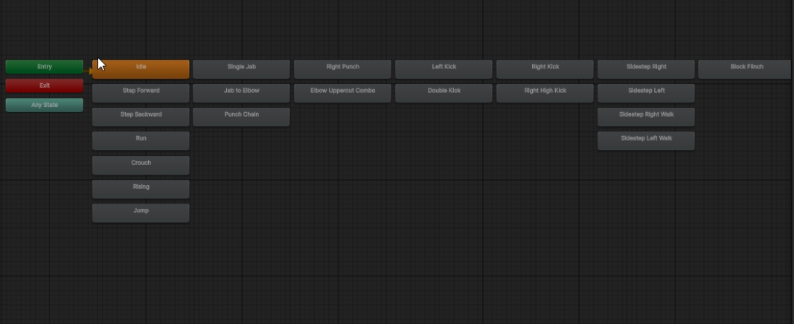

# 3D Fighting Game (Unity)

A 3D fighting game built in Unity as a Final Year Project for my dissertation.  
The game focuses on building a modular combat system, structured gameplay architecture, and responsive character control.

---

## Features

This project focuses on building a structured 3D fighting game with modular systems and scalable gameplay architecture.

### 🥊 Combat System
- Custom attack and combo logic
- Hit detection using collision-based systems
- Character-specific movesets
- State-driven combat flow (attack, hit, idle, etc.)

### 🏃 Movement & Controls
- Responsive character movement system
- Input handling designed for fast-paced gameplay
- Movement tied into combat states for smoother transitions

### 🎮 Character System
- Multiple playable characters
- Individual animations and behaviours per character
- Modular structure for adding new fighters

### 🧠 Game Architecture
- Modular script-based system (Combat, Movement, Input, State, Camera)
- Clean separation of systems for scalability
- Data-driven structure for characters, stages, and gameplay values

### 🖥️ UI System
- Health bars and match HUD
- Main menu and pause menu systems
- In-game feedback for actions (damage, notifications, etc.)

---

## 📸 Screenshots










---

## How to play game:

- Install zip from gitlab
- Use this link to install Assets:
    > https://rhul-my.sharepoint.com/:f:/g/personal/zmac392_live_rhul_ac_uk/IgBBgEApJ_ijTrVnq68EA3ELAbtXf20ZQSJOOUcaIwP-CKI
    
    If the link above does not work, use this link:
    > https://drive.google.com/drive/folders/1yh_OQDLW3Thv02jP2_NNV_T6Bn9UdAGZ?usp=drive_link

- Move the folders from inside the FYP Assets into the project folder. Use the tree below to help you. (Alternatively, you can use my list)
    - Assets/Art
    - Assets/Art.meta
    - Assets/Stages
    - Assets/Stages.meta

    - Assets/Project/Data
    - Assets/Project/Data.meta
    - Assets/Project/Prefabs
    - Assets/Project/Prefabs.meta
    - Assets/Project/Scenes
    - Assets/Project/Scenes.meta

- After relocating the assets folders correctly, launch unity and play the game

## Project Structure:

### Tree:

```
C:.
└───product
    ├───Assets
    │   ├───Art
    │   │   ├───Characters
    │   │   │   ├───Player1
    │   │   │   │   ├───Animations
    │   │   │   │   ├───Materials
    │   │   │   │   ├───Models
    │   │   │   │   │   ├───knight.fbm
    │   │   │   │   │   └───Materials
    │   │   │   │   └───Textures
    │   │   │   ├───Player2
    │   │   │   └───Player3
    │   │   │       ├───Animations
    │   │   │       ├───Materials
    │   │   │       ├───Models
    │   │   │       │   ├───akai_e_espiritu@T-Pose.fbm
    │   │   │       │   ├───archer.fbm
    │   │   │       │   └───Materials
    │   │   │       └───Textures
    │   │   ├───Effects
    │   │   │   ├───Particles
    │   │   │   └───VFX
    │   │   ├───Stages
    │   │   │   ├───Materials
    │   │   │   │   ├───Howard Estate
    │   │   │   │   └───T8 Arena
    │   │   │   ├───Models
    │   │   │   │   ├───Howard Estate
    │   │   │   │   └───T8 Arena
    │   │   │   │       └───Editor
    │   │   │   └───Textures
    │   │   │       ├───Howard Estate
    │   │   │       └───T8 Arena
    │   │   └───UI
    │   │       └───TextMesh Pro
    │   │           ├───Fonts
    │   │           ├───Resources
    │   │           │   ├───Fonts & Materials
    │   │           │   ├───Sprite Assets
    │   │           │   └───Style Sheets
    │   │           ├───Shaders
    │   │           └───Sprites
    │   ├───Audio
    │   │   ├───Music
    │   │   ├───SFX
    │   │   └───Voices
    │   ├───Project
    │   │   ├───Data
    │   │   │   ├───Audio
    │   │   │   ├───Camera
    │   │   │   ├───Characters
    │   │   │   │   ├───Player1
    │   │   │   │   └───Player2
    │   │   │   └───Stages
    │   │   ├───Prefabs
    │   │   │   ├───Audio
    │   │   │   ├───Characters
    │   │   │   ├───Effects
    │   │   │   ├───Stage
    │   │   │   └───UI
    │   │   ├───Scenes
    │   │   └───Scripts
    │   │       ├───Health
    │   │       ├───Main Menu
    │   │       ├───Managers
    │   │       ├───Match
    │   │       ├───Pause Menu
    │   │       ├───Systems
    │   │       │   ├───Animation
    │   │       │   ├───Camera
    │   │       │   ├───Collision
    │   │       │   │   ├───CollisionBox
    │   │       │   │   └───Stage
    │   │       │   ├───Combat
    │   │       │   │   └───Enums
    │   │       │   ├───Input
    │   │       │   ├───Movement
    │   │       │   ├───Moves
    │   │       │   ├───Player
    │   │       │   └───State
    │   │       ├───Tests
    │   │       ├───UI
    │   │       └───Utilities
    │   └───Settings
```
